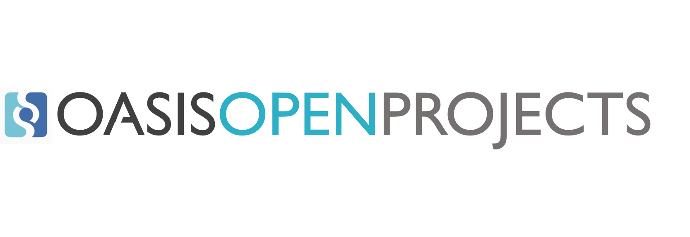
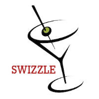

##  Swizzle Stick

Swizzle Stick is a colorful, compact parallelogram, typically (but not exclusively) polymer-based, optimized for mixing liquids of differing viscosities and specific gravities while also providing whimsical flourishes that contribute to the beverage consumer’s sense of enjoyment. Swizzle Stick is interoperable with all consumable fluids and most cocktail receptacles.

Contributions to this project are welcomed from all parties, whether affiliated with OASIS or not. Participants must have a GitHub account, but no fees or OASIS membership obligations are required. Participation is expected to be consistent with the OASIS Open Project rules, the open source LICENSE designated for each repository, and the requirement for a Contributor License Agreement for substantive contributions.

This project maintains a mailing list for updates and announcements. For instructions on how to subscribe to the list, see -----. This list is publicly archived at http://lists.oasis-open.org/archive/swizzle-stick

## Project Governance

Swizzle Stick is an OASIS Open Project overseen by the members of its Project Governance Board (PGB):  

- Dale DeGroff, Seagrams (Chair)
- Harry MacElhone, Anheuser Busch (Secretary)
- Ada Coleman, Distilled Spirits Council US
- Dick Bradsell, Jim Beam
- William “Cocktail” Boothbay, Individual
- Derek Brown, Bacardi

Technical work is guided by the members of the Technical Steering Committee (TSC): 

- Ada Coleman, Distilled Spirits Council US
- Derek Brown, Bacardi
- Dale DeGroff, Open Containers Inc

Maintainers of the project are: 

- Dave Borden, Open Containers Inc. 
- Terry Hagen, Distilled Spirits Council 

## Get involved 

## Have questions? Need help? 
